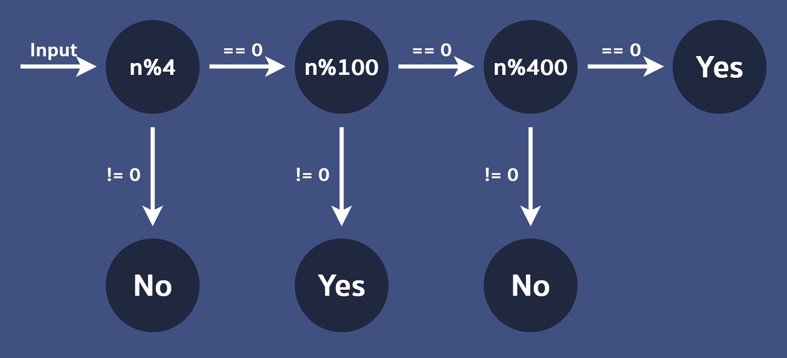

# Example

### Leap year

Another classic problem when you start programming is determining if the year is a leap year or not.

#### Input

A single integer $n$ when $0 \leq n \leq 10000$

#### Output

`Yes` if $n$ is a leap year, `No` otherwise.

#### Sample Input 1

```
2007
```

#### Sample Output 1

```
No
```

#### Sample Input 2

```
2008
```

#### Sample Output 2

```
Yes
```

#### Sample Input 3

```
1800
```

#### Sample Output 3

```
No
```

#### Sample Input 4

```
2000
```

#### Sample Output 4

```
Yes
```

### Hint 1

<details>

<summary>Condition of a leap year</summary>

- If the year is divisible by $4$, it is a leap year
- Unless the year is divisible by $100$, then it is **not** a leap year
- Unless the year is divisible by $400$, then it is a leap year

</details>

<hr/>

### Hint 2

<details>

<summary>If-else branches</summary>



</details>

<hr/>

### Solution 1

<details>

<summary>Full code</summary>

```c
#include <stdio.h>

int main() {
    int n;
    scanf("%d", &n);

    if (n % 4 != 0) {
        printf("No\n");
    }
    else if (n % 100 != 0) {
        printf("Yes\n");
    }
    else if (n % 400 != 0) {
        printf("No\n");
    }
    else {
        printf("Yes\n");
    }
}
```

</details>

<hr/>

### Solution 2

<details>

<summary>Full code (More compact)</summary>

Different code, same result

```c
#include <stdio.h>

int main() {
    int n;
    scanf("%d", &n);

    if (n % 4 == 0 && (n % 100 != 0 || n % 400 == 0)) {
        printf("Yes\n");
    }
    else {
        printf("No\n");
    }
}
```

</details>

<hr/>