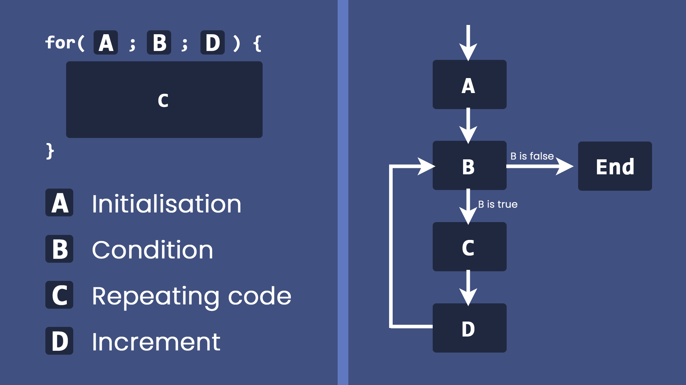

# For Loop

This is one of the most common loop to be used. Let's adapt the functionality from example code of [07-01 While Loop](./07-01%20While%20Loop.md)

We want to count from `0` to `4`. In `while` loop, the code looks like this.

```c
int counter = 0;
while (counter < 5) {
    printf("%d ", counter);
    counter++;
}
```

But in `for` loop, the code would look like this

```c
for(int counter=0; counter < 5; counter++) {
    printf("%d ", counter);
}
```

Most of the time you would see

```c
for(int i=0; i < 5; i++) {
    printf("%d ", i);
}
```

`i` stands for ***iterator***

So, how does it work?



- `A` Initialisation is executed ***only*** when the for loop first reached
- `B` Condition is checked right after the initialisation and before after each increment
- `C` This is the part where we put the code that will be repeated multiple times
- `D` Increment is executed after each loop